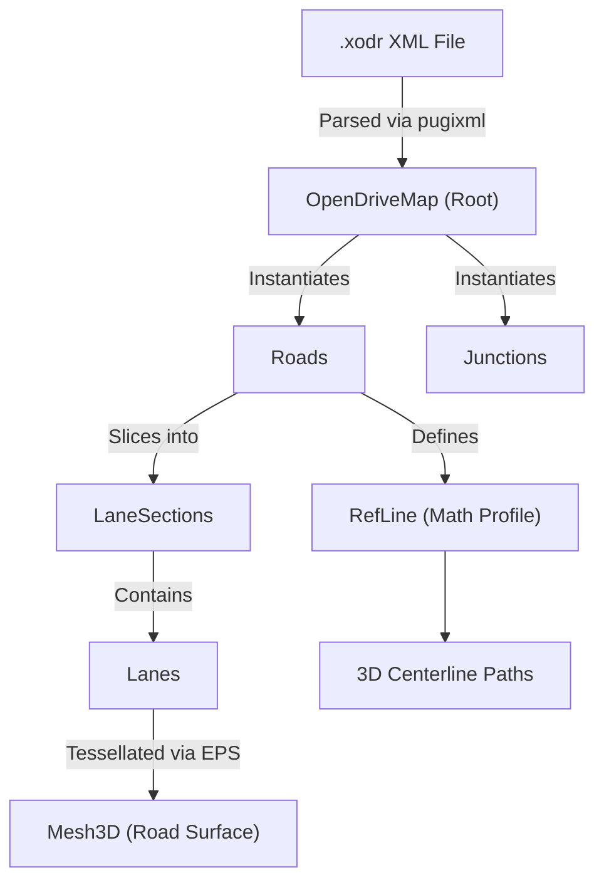

# libOpenDRIVE Architecture Overview

This document provides a high-level summary of the `libOpenDRIVE` parsing and mesh generation library. It is designed to act as an onboarding guide to easily integrate OpenDRIVE map data into external projects or game engines.

## Core Purpose
The `libOpenDRIVE` library parses `.xodr` (XML-based) OpenDRIVE format maps and constructs highly accurate 3D geometry representations (meshes, paths, routing graphs) that can be easily fed into rendering pipelines or traffic simulation tools.

## Key Data Structures

1. **`odr::OpenDriveMap`** (`OpenDriveMap.h`):
   - The root object containing the world map.
   - It maintains collections of `Road` and `Junction` objects mapped by their IDs.
   - Responsible for generating the holistic `RoadNetworkMesh` and the overall `RoutingGraph`.

2. **`odr::Road`** (`Road.h`):
   - Represents a continuous stretch of road.
   - Contains mathematical geometries that govern the curvature (e.g., `CubicSpline`, `Spiral`, etc.) via `RefLine` and various elevation profiles.
   - Owns `LaneSection`s (which define lanes starting at specific offsets `s`), `RoadObject`s (signs, poles, structures), and `RoadSignal`s.

3. **`odr::Lane` & `odr::LaneSection`**:
   - `LaneSection` handles lane layouts at a specific mathematical offset `s` along the road's `RefLine`.
   - `Lane` stores semantic properties (driving, parking, sidewalk) and physical dimensions (width polynomial functions).

4. **`odr::RoutingGraph`**:
   - A graph of `LaneKey`s and edges representing where vehicles can logically travel from one lane to another. 
   - Supports shortest-path algorithms.

5. **`odr::Mesh3D` & `odr::RoadNetworkMesh`**:
   - Geometry buffer classes (vertices, indices, normals, UVs).
   - Functions like `Road::get_lane_mesh()` tessellate the mathematical splines into triangle indices that are easily ingested by graphics APIs (like OpenGL, Vulkan, DirectX).

## Data Flow

