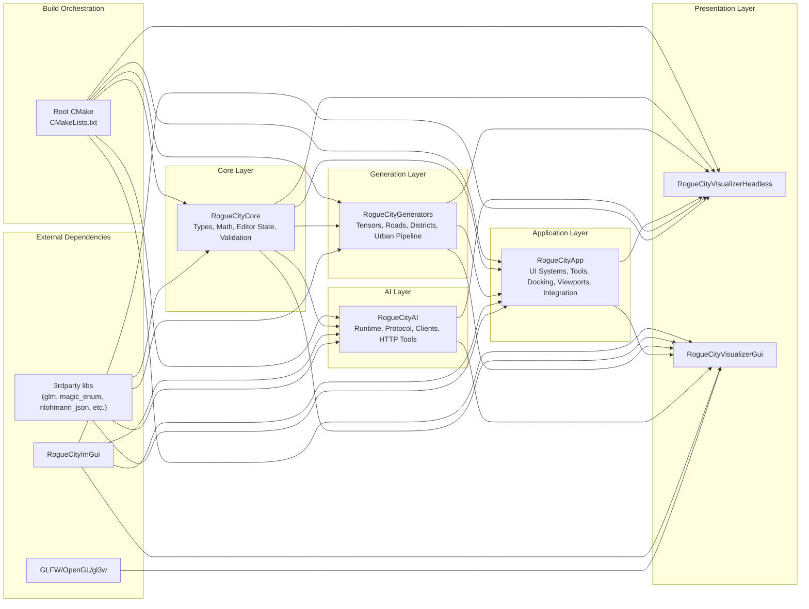
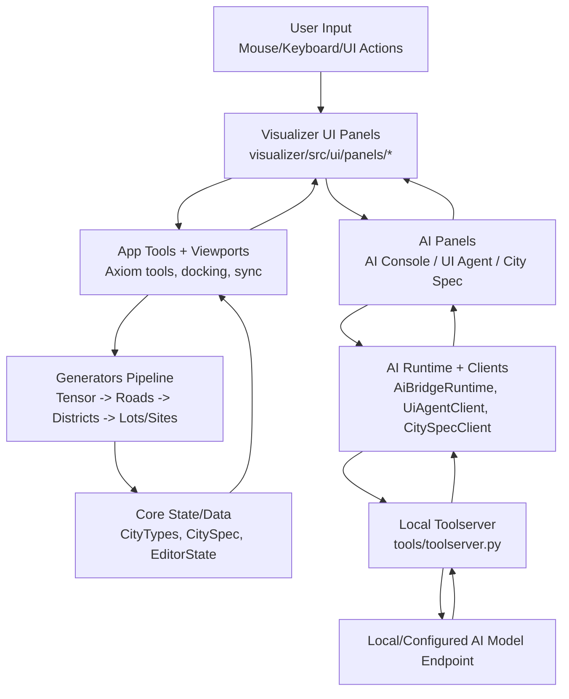

# RogueCities Architecture Diagram

This diagram summarizes the main components, their relationships, and runtime data flow.

## Component Relationships

## Runtime Data Flow

## Notes

- Primary libraries: `RogueCityCore`, `RogueCityGenerators`, `RogueCityApp`, `RogueCityAI`.
- Primary executables: `RogueCityVisualizerHeadless`, `RogueCityVisualizerGui`.
- Root source-of-truth wiring: `CMakeLists.txt`, `core/CMakeLists.txt`, `generators/CMakeLists.txt`, `app/CMakeLists.txt`, `AI/CMakeLists.txt`, `visualizer/CMakeLists.txt`.
