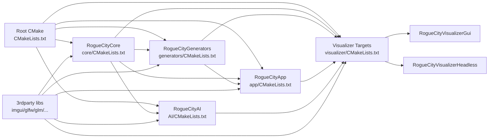
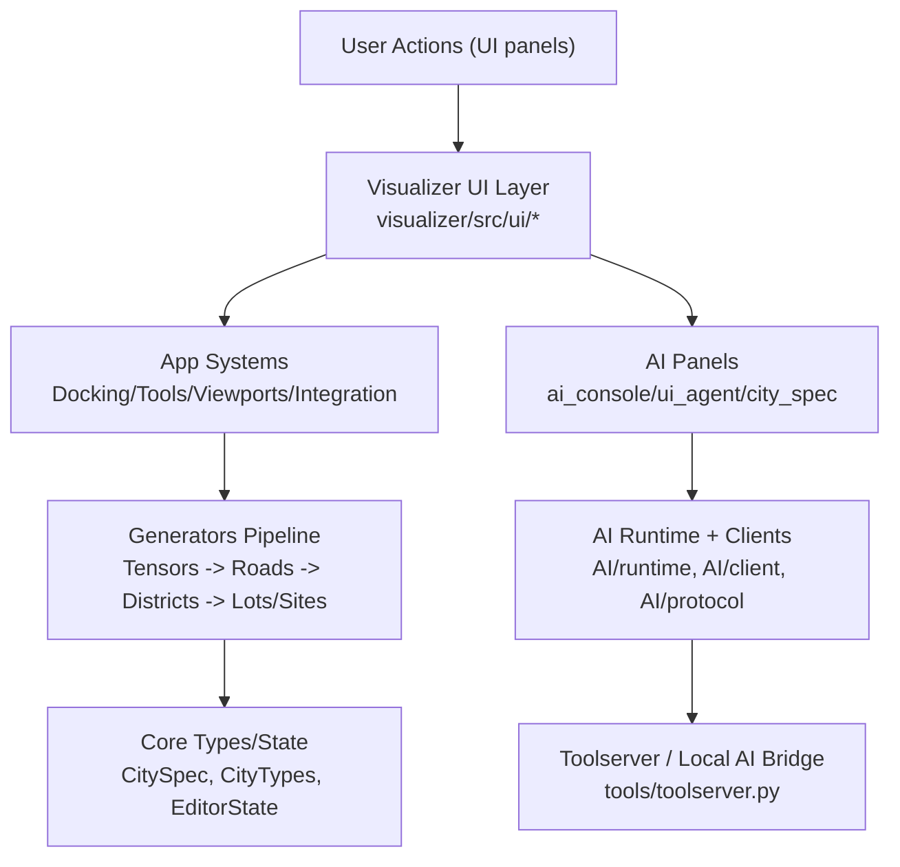

# RogueCities Architecture Map

This document provides a visual architecture map for `RogueCities_UrbanSpatialDesigner` based on the current module and CMake wiring.

## 1) Folder Structure (Architecture-Focused)

```text
RogueCities_UrbanSpatialDesigner/
├─ CMakeLists.txt                    # Root build orchestration
├─ core/                             # RogueCityCore (data + math + editor state)
│  ├─ include/RogueCity/Core/
│  └─ src/Core/
│     ├─ Data/ Math/ Editor/ Texture/ Validation/ Export/
├─ generators/                       # RogueCityGenerators (procedural pipeline)
│  ├─ include/RogueCity/Generators/
│  └─ src/Generators/
│     ├─ Tensors/ Roads/ Districts/ Urban/ Pipeline/ Geometry/
├─ app/                              # RogueCityApp (editor app-layer systems)
│  ├─ include/RogueCity/App/
│  └─ src/
│     ├─ UI/ Tools/ Editor/ Docking/ Viewports/ Integration/
├─ AI/                               # RogueCityAI (assistant runtime + clients)
│  ├─ config/ runtime/ protocol/ tools/ integration/ client/
│  └─ docs/
├─ visualizer/                       # Executables: headless + GUI
│  ├─ src/main.cpp
│  ├─ src/main_gui.cpp
│  └─ src/ui/
│     ├─ panels/ patterns/ viewport/ introspection/
├─ tests/                            # test_core, test_generators, test_ai, etc.
├─ tools/                            # check_ui_compliance.py, AI bridge scripts
└─ 3rdparty/                         # imgui, glfw, glm, magic_enum, nlohmann_json, ...
```

## 2) Module Dependency Graph



## 3) Runtime Feature Flow



## 4) Main Modules and Responsibilities

- `RogueCityCore`: foundational types, math, editor state, and validation; no UI coupling.
- `RogueCityGenerators`: procedural city generation algorithms and stage pipeline.
- `RogueCityApp`: editor behaviors, viewport synchronization, docking, and tool interactions.
- `RogueCityAI`: AI bridge runtime, protocol/contracts, and assistant clients.
- `Visualizer`: final executables combining all modules into headless and GUI applications.

## 5) Source of Truth

This map was derived from:

- `CMakeLists.txt`
- `core/CMakeLists.txt`
- `generators/CMakeLists.txt`
- `app/CMakeLists.txt`
- `AI/CMakeLists.txt`
- `visualizer/CMakeLists.txt`
